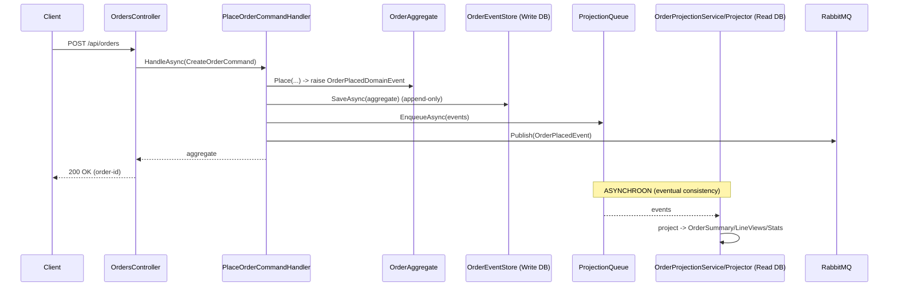
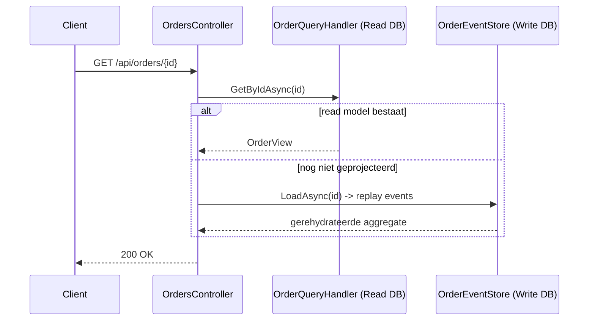
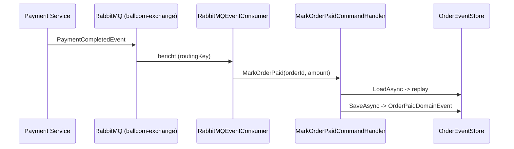

# Ordering Service — Event Sourcing & CQRS (assessment-uitleg)

Dit document legt **volledig** uit hoe de Ordering-service werkt: hoe Event Sourcing is
toegepast, hoe de **schrijfkant (C)** en **leeskant (Q)** werken, welke route data aflegt,
wat elke map en elk bestand doet, en hoe je het geheel morgen live kunt **testen/demonstreren**.

> De Ordering-service is onze **referentie-implementatie**. Hier bestaat de orderstaat niet
> als tabelrij, maar wordt hij in code opgebouwd door de events opnieuw af te spelen
> (rehydratie). De leeskant is fysiek gescheiden en wordt asynchroon bijgewerkt.

---

## 1. De kernconcepten in één alinea

- **Event Sourcing (ES):** de enige bron van waarheid is een **append-only** tabel
  `OrderEvents`. Er is **geen** `Orders`-statustabel. De huidige staat van een order wordt
  *berekend* door zijn events opnieuw af te spelen (`Rehydrate` → `Apply`).
- **CQRS:** schrijven (Command) en lezen (Query) zijn volledig gescheiden — aparte
  `DbContext`, aparte tabellen. De schrijfkant produceert events; de leeskant bestaat uit
  **gedenormaliseerde** read models (geen foreign keys).
- **Eventual consistency:** na het wegschrijven van een event wordt de leeskant
  **asynchroon** bijgewerkt via een **interne queue** (`System.Threading.Channels`). De
  HTTP-request wacht daar niet op.
- **Event-Driven Architecture (EDA):** cross-service communicatie loopt via **RabbitMQ**
  (`OrderPlacedEvent` naar Payment; `PaymentCompletedEvent` terug naar Ordering).

---

## 2. Overzicht van alle mappen en bestanden

```
BallCom.Ordering.API/
├── Program.cs                     ← opstart + Dependency Injection (alles wordt hier geregistreerd)
├── appsettings.json               ← connection string (Postgres) + RabbitMQ host
├── appsettings.Development.json   ← logging-instellingen voor development
├── Dockerfile                     ← image-build voor container (poort 8080 → host 5100)
│
├── Controllers/
│   └── OrdersController.cs        ← HTTP-endpoints; splitst COMMAND (POST) en QUERY (GET)
│
├── Application/                   ← de "use cases" (CQRS-handlers), losgekoppeld van HTTP
│   ├── Commands/
│   │   ├── PlaceOrderCommandHandler.cs        ← order plaatsen (validatie → event → opslaan → queue → publish)
│   │   └── OrderLifecycleCommandHandlers.cs   ← MarkOrderPaid + CancelOrder (laden via replay → nieuw event)
│   └── Queries/
│       └── OrderQueryHandler.cs   ← leest UITSLUITEND uit de read models (AsNoTracking)
│
├── Domain/                        ← het hart: business-logica, onafhankelijk van infrastructuur
│   ├── OrderAggregate.cs          ← aggregate root; Rehydrate/Apply/Raise + business-regels
│   ├── OrderEventTypeRegistry.cs  ← mapt opgeslagen EventType-naam → .NET-type (voor deserialisatie)
│   └── Events/
│       └── OrderDomainEvents.cs   ← de interne domein-events (IOrderEvent + records)
│
├── Data/                          ← persistentie (Event Store + de twee DbContexts)
│   ├── OrderEventStore.cs         ← LoadAsync (replay), SaveAsync (append-only), NextOrderIdAsync
│   ├── OrderingWriteDbContext.cs  ← SCHRIJFKANT: alleen OrderEvents + Products-referentie
│   ├── OrderingReadDbContext.cs   ← LEESKANT: alleen de read models
│   └── OrderingDbInitializer.cs   ← maakt het DB-schema idempotent aan (CREATE IF NOT EXISTS)
│
├── ReadModels/
│   └── OrderReadModels.cs         ← de 3 gedenormaliseerde leestabellen (Summary/LineView/Stat)
│
├── Projections/                   ← de brug van events → read models (leeskant vullen)
│   ├── ProjectionQueue.cs         ← interne async queue (in-process Channel)
│   ├── OrderProjectionService.cs  ← BackgroundService die de queue leegt
│   ├── OrderReadModelProjector.cs ← zet events om naar rijen in de read models
│   └── ReadModelRebuilder.cs      ← herbouwt ALLE read models vanuit de event store (replay)
│
├── Messaging/                     ← cross-service EDA via RabbitMQ
│   ├── IEventPublisher.cs         ← abstractie voor publiceren
│   ├── RabbitMQEventPublisher.cs  ← publiceert integratie-events op ballcom-exchange (fanout)
│   └── RabbitMQEventConsumer.cs   ← consumeert PaymentCompleted/ProductAdded/ProductUpdated
│
└── Models/
    ├── Order.cs                   ← command-DTO's (CreateOrderCommand) + integratie-event OrderPlacedEvent + OrderStatus
    ├── Product.cs                 ← lokale product-referentie + integratie-event-contracten (inkomend)
    └── StoredEvent.cs             ← één rij in de append-only event store
```

### Functie van elk bestand (detail)

| Bestand | Verantwoordelijkheid |
|---|---|
| `Program.cs` | Registreert de twee `DbContext`s, de event store, de command-/query-handlers, de `ProjectionQueue` (singleton), de `OrderProjectionService` en de RabbitMQ-publisher/consumer. Draait `OrderingDbInitializer` bij het opstarten. |
| `Controllers/OrdersController.cs` | Vertaalt HTTP naar de juiste handler. **POST** = command-kant, **GET** = query-kant. Bevat ook de ES-inspectie-endpoints (`/events`, `/replay`) en de *read-your-writes fallback*. |
| `Application/Commands/PlaceOrderCommandHandler.cs` | Valideert klant + productregels, kent een order-id toe, laat de aggregate `OrderPlacedDomainEvent` raisen, schrijft append-only weg, zet het event op de queue en publiceert `OrderPlacedEvent` naar RabbitMQ. |
| `Application/Commands/OrderLifecycleCommandHandlers.cs` | `MarkOrderPaidCommandHandler` en `CancelOrderCommandHandler`. Beide: **laden via replay** (`LoadAsync`) → business-methode op de aggregate → `SaveAsync` → op de queue. |
| `Application/Queries/OrderQueryHandler.cs` | Alle leesoperaties. Raakt de event store nooit aan; leest met `AsNoTracking()` uit de read models. |
| `Domain/OrderAggregate.cs` | De aggregate root. `Rehydrate` (replay), `Apply` (event → in-memory staat), `Raise` (nieuw event), en de commands `Place/MarkPaid/StartProcessing/Cancel` met hun business-regels en idempotentie. |
| `Domain/OrderEventTypeRegistry.cs` | Zet de opgeslagen `EventType`-string terug naar het concrete type, zodat de JSON-payload correct gedeserialiseerd wordt bij replay. |
| `Domain/Events/OrderDomainEvents.cs` | De interne domein-events: `OrderPlacedDomainEvent`, `OrderPaidDomainEvent`, `OrderProcessingStartedDomainEvent`, `OrderCancelledDomainEvent` (alle `IOrderEvent`). |
| `Data/OrderEventStore.cs` | Kern van ES: `LoadAsync` (leest stream → `Rehydrate`), `SaveAsync` (append-only met oplopende `Version`), `ReadRawStreamAsync` (ruwe events), `NextOrderIdAsync` (Postgres-sequence). |
| `Data/OrderingWriteDbContext.cs` | Schrijfkant. `DbSet<StoredEvent> OrderEvents` + unieke index `(StreamId, Version)` voor optimistic concurrency. Plus read-only `Products`-referentie. |
| `Data/OrderingReadDbContext.cs` | Leeskant. Alleen de drie read models. Logisch (en potentieel fysiek) gescheiden van de schrijfkant. |
| `Data/OrderingDbInitializer.cs` | Maakt schema aan met `CREATE TABLE IF NOT EXISTS` (idempotent, werkt ook op bestaand volume) + de `order_id_seq` sequence. |
| `ReadModels/OrderReadModels.cs` | `OrderSummary` (1 rij/order), `OrderLineView` (regels, **geen FK**), `CustomerOrderStat` (orders + besteed per klant). |
| `Projections/ProjectionQueue.cs` | Een unbounded `Channel<IReadOnlyList<IOrderEvent>>`: de interne queue van de microservice. |
| `Projections/OrderProjectionService.cs` | `BackgroundService` die de queue leegt en per batch de projector aanroept binnen een eigen DI-scope. |
| `Projections/OrderReadModelProjector.cs` | De projectielogica: `OrderPlaced` → nieuwe summary + lines + klantstatistiek; statuswijzigingen → update summary. Idempotent. |
| `Projections/ReadModelRebuilder.cs` | Truncate + herbouw van alle read models door **alle** events opnieuw af te spelen. Bewijst dat de leeskant wegwerpbaar/afleidbaar is. |
| `Messaging/IEventPublisher.cs` | Interface `Publish<T>(T @event)`. |
| `Messaging/RabbitMQEventPublisher.cs` | Serialiseert het event naar JSON en publiceert op de fanout-exchange `ballcom-exchange` met routing key = typenaam. |
| `Messaging/RabbitMQEventConsumer.cs` | Luistert op `ordering-service-queue`; vertaalt `PaymentCompletedEvent` → command `MarkOrderPaid`, en `ProductAdded/Updated` → bijwerken lokale productreferentie. |
| `Models/Order.cs` | `CreateOrderCommand` + `CustomerDetailsDto` + `OrderItemDto` (input), `OrderPlacedEvent` (integratie-event, klein contract), `OrderStatus`-constanten. |
| `Models/Product.cs` | Lokale `Product`-referentie (uit Catalog) + de inkomende integratie-event-records. |
| `Models/StoredEvent.cs` | Eén event-rij: `Sequence`, `StreamId`, `AggregateType`, `Version`, `EventType`, `Payload` (JSON), `OccurredAt`. |

---

## 3. De SCHRIJFKANT (C) — volledige route

**Doel:** een intentie (command) veilig omzetten in onveranderlijke events.

### Stap voor stap: een order plaatsen (`POST /api/orders`)

1. **HTTP binnen** → `OrdersController.Create(CreateOrderCommand)`.
2. **Handler** `PlaceOrderCommandHandler.HandleAsync`:
   - valideert klantgegevens en productregels (`ValidateItemsAsync` haalt prijzen uit de
     lokale `Products`-referentie);
   - vraagt een nieuw id op via `OrderEventStore.NextOrderIdAsync()` (Postgres-sequence);
   - roept de factory `OrderAggregate.Place(...)` aan → die **raist** een
     `OrderPlacedDomainEvent`.
3. **Append-only opslaan** → `OrderEventStore.SaveAsync(aggregate)`:
   - haalt de nog niet opgeslagen events op (`DequeueUncommittedEvents`);
   - schrijft ze weg met oplopende `Version`; de unieke index `(StreamId, Version)` dwingt
     optimistic concurrency af.
4. **Asynchroon leeskant** → `ProjectionQueue.EnqueueAsync(appended)` (request wacht niet).
5. **EDA** → `IEventPublisher.Publish(new OrderPlacedEvent(...))` naar RabbitMQ (voor Payment).
6. **Response** komt uit de zojuist gebouwde aggregate, zodat de client meteen het `int`
   order-id heeft (ook al is de leeskant nog eventueel consistent).

### Stap voor stap: order betaald / geannuleerd (event-sourcing-recept)

Dit is het mooiste bewijs van ES, want de aggregate wordt hier **eerst uit events herbouwd**:

1. `MarkOrderPaidCommandHandler` / `CancelOrderCommandHandler` roept
   `OrderEventStore.LoadAsync(orderId)` → **replay** van de hele stream → gerehydrateerde
   aggregate.
2. Business-methode op de aggregate: `aggregate.MarkPaid(amount)` of `aggregate.Cancel(reason)`.
   Die controleert invarianten (bv. *"een geannuleerde order kan niet betaald worden"*) en
   raist bij succes een nieuw event.
3. `SaveAsync` schrijft alleen het nieuwe event append-only bij.
4. Event op de `ProjectionQueue` → leeskant wordt bijgewerkt.

> `MarkPaid` is **idempotent**: is de order al betaald, dan wordt er geen tweede event
> geraised. Belangrijk omdat `PaymentCompletedEvent` via RabbitMQ *at-least-once* kan
> binnenkomen.

---

## 4. De LEESKANT (Q) — volledige route

**Doel:** snelle, gedenormaliseerde reads zonder de event store te raken.

### Hoe de read models gevuld worden (asynchroon)

1. De command-kant zet nieuwe events op de `ProjectionQueue`.
2. `OrderProjectionService` (een `BackgroundService`) leest de queue leeg
   (`await foreach ... ReadAllAsync`), opent een eigen DI-scope en roept
   `OrderReadModelProjector.ProjectAsync(events)` aan.
3. `OrderReadModelProjector` past de events toe op de read models:
   - `OrderPlacedDomainEvent` → nieuwe `OrderSummary` + `OrderLineView`s + `CustomerOrderStat`
     bijwerken;
   - status-events → `OrderSummary.Status` updaten.
   - Idempotent: bestaat de summary al, dan wordt het event overgeslagen.
4. `SaveChangesAsync` op de **read**-context.

### Hoe er gelezen wordt (`GET`)

- `OrderQueryHandler` leest met `AsNoTracking()` uit `OrderingReadDbContext`:
  - `GetByIdAsync` → `OrderSummary` + bijbehorende `OrderLineView`s;
  - `GetAllAsync` → alle summaries;
  - `GetCustomerStatsAsync` → de klantstatistiek.
- **Read-your-writes fallback:** als de projectie nog niet klaar is en
  `GET /api/orders/{id}` niets in de read model vindt, valt de controller terug op
  `OrderEventStore.LoadAsync(id)` → het antwoord wordt dan alsnog uit de events
  gerehydrateerd. Zo ziet de gebruiker nooit een "nog niet bestaande" order.

---

## 5. Event Sourcing in detail: rehydratie & replay

### Rehydratie (aggregate opbouwen uit events)

`OrderEventStore.LoadAsync` leest de stream (op `Version` gesorteerd), deserialiseert elke
payload via de `OrderEventTypeRegistry`, en roept `OrderAggregate.Rehydrate(history)` aan.
`Rehydrate` past elk event via `Apply` toe — exact dezelfde `Apply` die ook bij het raisen
van nieuwe events wordt gebruikt. Resultaat: de aggregate "weet" zijn actuele status zonder
ooit een statusrij te lezen.

### Volledige herbouw (`POST /api/orders/replay`)

`ReadModelRebuilder.RebuildAsync`:
1. `TRUNCATE` op `OrderSummaries`, `OrderLineViews`, `CustomerOrderStats`;
2. lees **alle** events (op globale `Sequence`);
3. speel ze opnieuw af via dezelfde `OrderReadModelProjector`.

Dit is hét bewijs dat de leeskant een **afgeleide, wegwerpbare projectie** is van de events.

### Inspectie (`GET /api/orders/{id}/events`)

Toont de ruwe, append-only event-stream van één order (`Sequence`, `Version`, `EventType`,
`OccurredAt`, `Payload`). Ideaal om tijdens het assessment te laten zien dat de historie
compleet en onveranderlijk is.

---

## 6. Cross-service (EDA via RabbitMQ)

- **Publisher:** na een geplaatste order publiceert Ordering `OrderPlacedEvent`
  (`int OrderId, decimal TotalPrice, DateTime`) op de fanout-exchange `ballcom-exchange`.
  Payment consumeert dit.
- **Consumer:** `RabbitMQEventConsumer` luistert op `ordering-service-queue` en verwerkt:
  - `PaymentCompletedEvent` → vertaald naar command `MarkOrderPaid` (→ replay → nieuw
    `OrderPaidDomainEvent` → projectie);
  - `ProductAddedEvent` / `ProductUpdatedEvent` → werkt de lokale `Products`-referentie bij.

> Let op het onderscheid: **domein-events** (`Domain/Events/`) leven in de event store;
> **integratie-events** (`Models/`) gaan over RabbitMQ. Bewust gescheiden zodat
> cross-service contracten stabiel blijven.

---

## 7. Diagrammen

### Command-flow (schrijfkant + async leeskant)



### Query-flow (leeskant met fallback)



### Betaling terug via RabbitMQ



---

## 8. Alles testen (voor het assessment)

### 8.1 Opstarten

**Optie A — alles in Docker (aanrader voor de demo):**

```bash
docker compose up -d --build
```

Ordering draait dan op **http://localhost:5100** (RabbitMQ-beheer op
http://localhost:15672, login `guest`/`guest`).

**Optie B — infra in Docker, Ordering lokaal (handig om logs live te zien):**

```bash
# alleen de databases + rabbitmq
docker compose up -d ordering_db rabbitmq

# in een aparte terminal
dotnet run --project BallCom.Ordering.API
```

Bij optie B luistert de service op de poort uit `launchSettings.json`
(**http://localhost:5019**); de connection string wijst naar `localhost:5432` uit
`appsettings.json`.

> Tip voor de demo: kies **optie B**. In de console-logs zie je live regels als
> `[Ordering ES] Order X geplaatst`, `... geprojecteerd naar de read models` en
> `[Ordering ES] START REBUILD ...`. Dat maakt de asynchrone leeskant zichtbaar.

### 8.2 De endpoints

| Kant | Methode & route | Doel |
|---|---|---|
| Command | `POST /api/orders` | order plaatsen (→ `OrderPlacedDomainEvent`) |
| Command | `POST /api/orders/{id}/cancel` | order annuleren |
| Query | `GET /api/orders` | overzicht (read model) |
| Query | `GET /api/orders/{id}` | detail (read model, met replay-fallback) |
| Query | `GET /api/orders/{id}/status` | status (F13) |
| Query | `GET /api/orders/stats/customers` | 2e read model: orders + besteed per klant |
| ES-inspectie | `GET /api/orders/{id}/events` | ruwe, append-only event-stream |
| ES-herbouw | `POST /api/orders/replay` | alle read models opnieuw opbouwen uit events |

### 8.3 Demo-scenario (dit laat ES + CQRS het beste zien)

De volgorde hieronder toont: event opslaan → asynchrone projectie → replay bewijst
afleidbaarheid.

```bash
# 0. Zorg dat er minstens één product bestaat (via Catalog / Supplier-portal),
#    zodat de order-validatie een geldige productId kan gebruiken.

# 1. Plaats een order  (COMMAND -> event)
curl -s -X POST http://localhost:5100/api/orders \
  -H "Content-Type: application/json" \
  -d '{
    "customer": { "email": "klant@example.com", "fullName": "Jan Klant",
      "street": "Hoofdstraat 1", "city": "Amsterdam", "postalCode": "1011AB", "country": "NL" },
    "items": [ { "productId": "<PLAK-HIER-EEN-BESTAANDE-GUID>", "quantity": 2, "price": 0 } ]
  }'
# -> respons bevat "id": <orderId>

# 2. Bekijk de ruwe event-stream (BEWIJS van Event Sourcing)
curl -s http://localhost:5100/api/orders/<orderId>/events

# 3. Lees de order uit het READ MODEL (QUERY-kant)
curl -s http://localhost:5100/api/orders/<orderId>

# 4. Annuleer de order (COMMAND -> tweede event in dezelfde stream)
curl -s -X POST http://localhost:5100/api/orders/<orderId>/cancel \
  -H "Content-Type: application/json" -d '{ "reason": "Demo" }'

# 5. Stream toont nu 2 events (Placed + Cancelled); read model toont status CANCELLED
curl -s http://localhost:5100/api/orders/<orderId>/events
curl -s http://localhost:5100/api/orders/<orderId>

# 6. Herbouw ALLE read models vanuit de events (BEWIJS: leeskant is afleidbaar)
curl -s -X POST http://localhost:5100/api/orders/replay

# 7. Tweede read model: orders + besteed bedrag per klant
curl -s http://localhost:5100/api/orders/stats/customers
```

> Onder Windows PowerShell kun je `curl` vervangen door `Invoke-RestMethod`, of gewoon de
> **Bruno**-collectie gebruiken (zie hieronder), wat voor de demo het overzichtelijkst is.

### 8.4 Testen met Bruno

De repo bevat een Bruno-collectie in `Bruno/Ball.Com/`. Relevant voor Ordering:

1. Kies de omgeving **Local** (poorten staan al goed; `orderingUrl = http://localhost:5100`).
2. Map `03-ordering/`:
   - **Place Order** — plaatst een order en zet automatisch `orderId` als variabele
     (`bru.setVar("orderId", ...)`), zodat de volgende requests die hergebruiken.
   - **Get Order By Id** — leest de order uit de leeskant.
3. Voor de volledige keten (order → betalen → picklist → …) staat er een end-to-end map
   `10-e2e-flow/` klaar.

### 8.5 Wat je live wilt aanwijzen tijdens het assessment

- **"Geen statustabel."** Open de write-DB (`ordering_db`, poort 5432) en laat zien dat er
  wél een `OrderEvents`-tabel is, maar **geen** `Orders`-tabel. De status leeft in de events.
- **"Aggregate uit events."** Laat `OrderAggregate.Rehydrate`/`Apply` en
  `OrderEventStore.LoadAsync` zien; benadruk dat `MarkPaid`/`Cancel` eerst laden via replay.
- **"C en Q gescheiden."** Twee `DbContext`s (`OrderingWriteDbContext` vs
  `OrderingReadDbContext`), twee sets tabellen, `AsNoTracking()` aan de leeskant.
- **"Asynchroon via interne queue."** `ProjectionQueue` + `OrderProjectionService`; in de
  logs zie je de projectie ná de HTTP-respons gebeuren.
- **"Read models zijn afleidbaar."** Draai `POST /api/orders/replay` en laat zien dat de
  overzichten identiek terugkomen.
- **"EDA."** Toon in de RabbitMQ-management-UI (poort 15672) de `ballcom-exchange` en de
  `ordering-service-queue`, en laat een betaling de order op `PAID` zetten.

### 8.6 Snelle probleemoplossing

- **`ConnectionStrings:Default is not configured`** → je draait lokaal zonder de env-var; de
  waarde staat in `appsettings.json` (host `localhost`). Controleer dat `ordering_db` draait.
- **Order plaatsen geeft "Product bestaat niet"** → er is nog geen product via Catalog
  binnengekomen. Voeg eerst een product toe (Supplier-portal / Catalog) zodat het
  `ProductAddedEvent` de lokale referentie vult.
- **`GET` vlak na `POST` toont niets** → dat is de eventual-consistency-window; de
  read-your-writes fallback vangt dit af, dus het detail-endpoint werkt toch. Even later is
  ook het overzicht bijgewerkt.
- **RabbitMQ nog niet bereikbaar** → de consumer probeert 10× met 3s tussenpauze; start
  `rabbitmq` vóór de service of wacht op de retries.

---

## 9. Samenvatting in één zin

Bij Ordering is een order **geen rij die je overschrijft**, maar een **stroom onveranderlijke
events**; de actuele toestand is het **berekende resultaat** van die events (`Rehydrate` →
`Apply`), de leeskant is een **asynchroon gevulde, wegwerpbare projectie** (`replay` bewijst
dat), en cross-service communicatie loopt via **RabbitMQ**.
